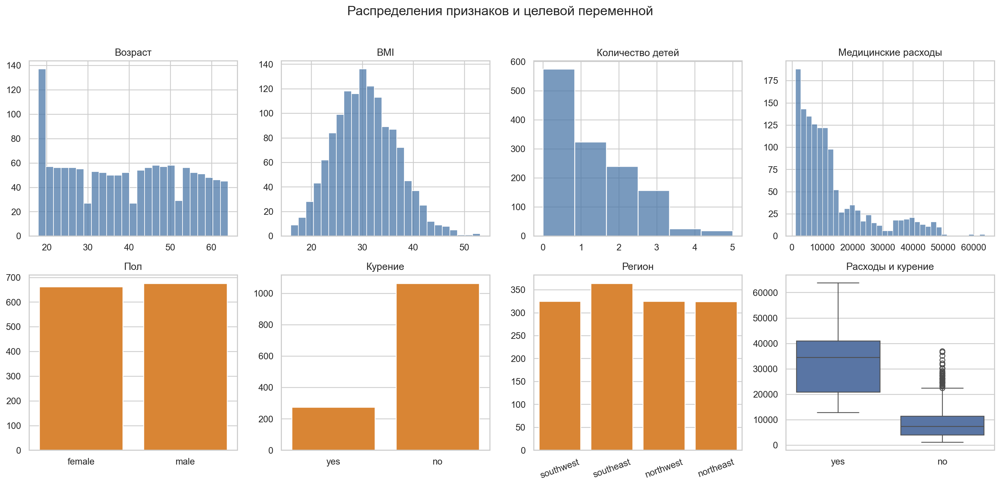
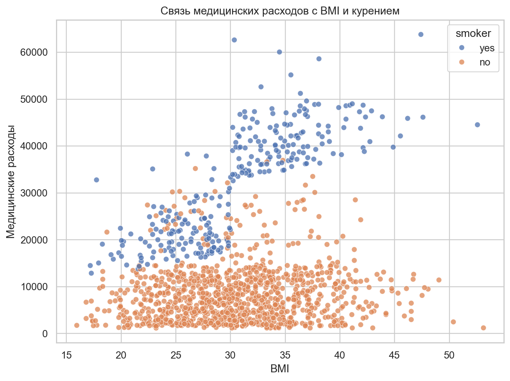
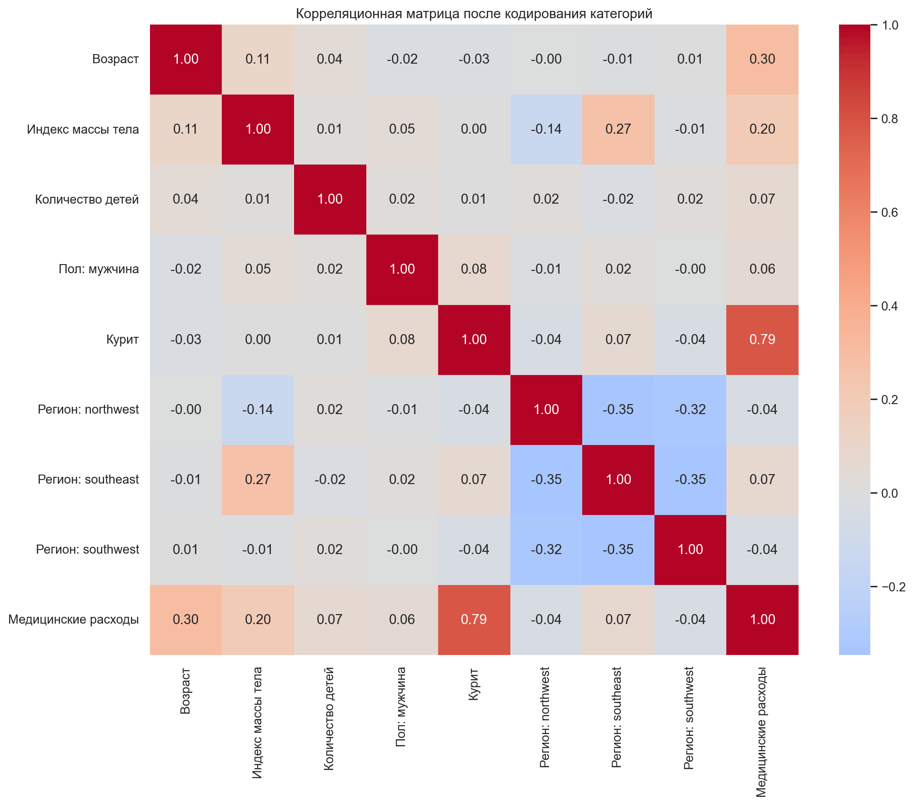
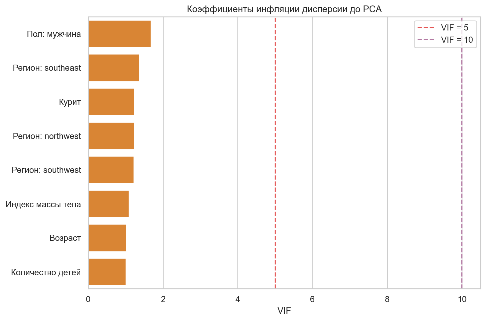
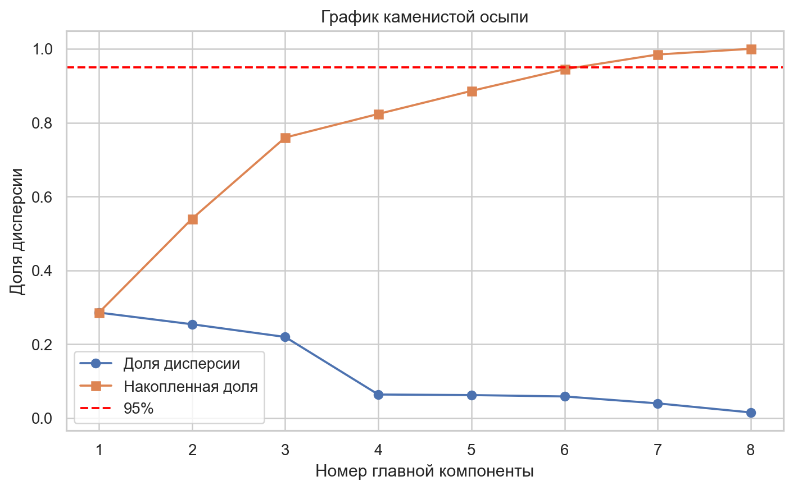
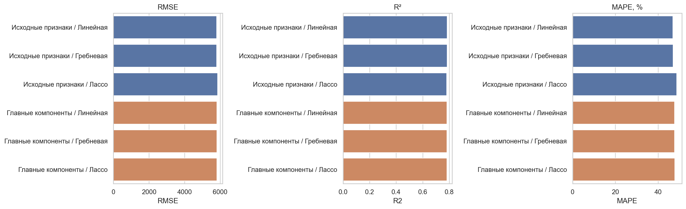
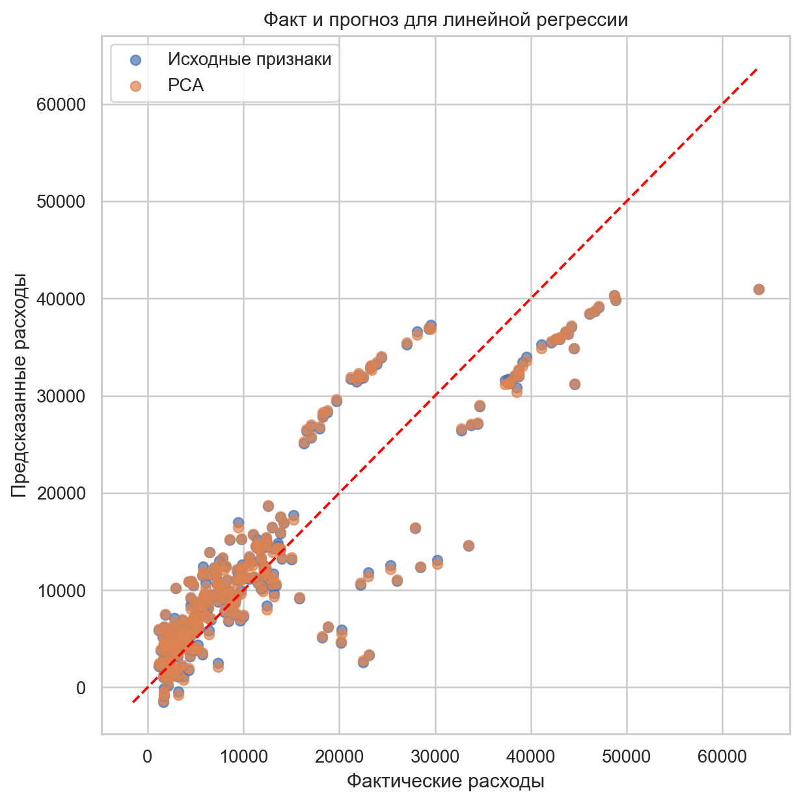

# Лабораторная работа 1. Линейная регрессия и факторный анализ

## Введение

Цель работы - изучить основы линейной регрессии, построить простейшие модели регрессии на реальных данных, оценить их качество и проверить влияние мультиколлинеарности.

В работе решаются задачи: загрузка датасета, первичный анализ и визуализация, предобработка данных, расчет корреляций и VIF, обучение линейной, гребневой и лассо-регрессии, применение PCA и сравнение метрик до и после PCA. Целевая переменная числовая, поэтому логистическая регрессия не используется.

## Описание датасета

Использован датасет Medical Cost Personal Dataset (`insurance.csv`), опубликованный в открытых репозиториях и на Kaggle. Он отличается от примера `MO_1lab`, где использовался автомобильный датасет Auto MPG. В этой работе прогнозируется стоимость медицинских расходов пациента.

Файл датасета скачан в `data/insurance.csv`. В выборке 1338 наблюдений и 7 столбцов. Целевая переменная - `charges`, медицинские расходы. Признаки: `age`, `sex`, `bmi`, `children`, `smoker`, `region`.

*Рисунок 1. Распределения признаков и целевой переменной.*

Распределение `charges` скошено вправо: у большинства пациентов расходы сравнительно небольшие, но есть группа с очень высокими расходами. Наиболее заметный фактор - курение: у курящих пациентов медианные и максимальные расходы значительно выше.

*Рисунок 2. Зависимость расходов от BMI с разделением по курению.*

По рисунку видно, что при одинаковом BMI курящие пациенты часто имеют гораздо более высокие расходы. Поэтому признак `smoker` должен оказаться одним из самых важных в линейной модели.

*Рисунок 3. Корреляционная матрица после кодирования категориальных признаков.*

После кодирования категориальных признаков сильнее всего с целевой переменной связан индикатор `smoker_yes`. Также положительная связь есть у возраста и BMI. Корреляции между исходными признаками умеренные, но VIF показывает, есть ли линейная зависимость каждого признака от остальных.

| feature_ru        | VIF  |
| ----------------- | ---- |
| Пол: мужчина      | 1.67 |
| Регион: southeast | 1.36 |
| Курит             | 1.23 |
| Регион: northwest | 1.22 |
| Регион: southwest | 1.22 |
| Индекс массы тела | 1.09 |
| Возраст           | 1.02 |
| Количество детей  | 1.00 |

*Рисунок 4. Коэффициенты инфляции дисперсии.*

Признаки с VIF выше 10: не обнаружены. Признаки с VIF от 5 до 10: не обнаружены. Значит, критической мультиколлинеарности в исходных данных нет, но PCA всё равно применяется по заданию, чтобы получить ортогональные компоненты и сравнить качество.

## Подготовка данных

Пропущенных значений в датасете нет. Числовые признаки `age`, `bmi`, `children` стандартизованы с помощью `StandardScaler`. Категориальные признаки `sex`, `smoker`, `region` закодированы методом one-hot с удалением первой категории, чтобы не создавать полную линейную зависимость между фиктивными переменными.

Выборка разделена на обучающую и тестовую в отношении 80/20: 1070 и 268 наблюдений. Все преобразования включены в `Pipeline`, поэтому стандартизация и кодирование обучаются только на тренировочной части в каждом фолде.

## Ход работы

### Модели на исходных признаках

Построены три модели: линейная регрессия, Ridge и Lasso. Для Ridge и Lasso параметр `alpha` подбирался по сетке `logspace(-3, 3, 50)` с 5-fold кросс-валидацией.

| features_title     | model_title | alpha   | CV_RMSE | CV_R2 | CV_MAPE | RMSE    | R2    | MAPE  |
| ------------------ | ----------- | ------- | ------- | ----- | ------- | ------- | ----- | ----- |
| Исходные признаки  | Линейная    |         | 6123.35 | 0.739 | 42.41   | 5796.28 | 0.784 | 46.89 |
| Исходные признаки  | Гребневая   | 0.4942  | 6123.47 | 0.739 | 42.49   | 5798.29 | 0.783 | 47.01 |
| Исходные признаки  | Лассо       | 79.0604 | 6129.42 | 0.738 | 42.68   | 5846.60 | 0.780 | 48.69 |
| Главные компоненты | Линейная    |         | 6122.54 | 0.739 | 42.46   | 5814.61 | 0.782 | 47.69 |
| Главные компоненты | Гребневая   | 0.1207  | 6122.66 | 0.739 | 42.47   | 5815.06 | 0.782 | 47.72 |
| Главные компоненты | Лассо       | 14.5635 | 6124.46 | 0.739 | 42.70   | 5812.40 | 0.782 | 47.76 |

Лучшая модель на исходных признаках по тестовому RMSE - Линейная: RMSE = 5796.28, R² = 0.784, MAPE = 46.89%.

Коэффициенты моделей на исходных признаках:

| feature_ru        | Линейная | Гребневая | Лассо    |
| ----------------- | -------- | --------- | -------- |
| Возраст           | 3614.98  | 3612.05   | 3540.12  |
| Индекс массы тела | 2036.23  | 2034.80   | 1907.52  |
| Количество детей  | 516.89   | 517.22    | 447.20   |
| Курит             | 23651.13 | 23583.48  | 23159.65 |
| Пол: мужчина      | -18.59   | -14.64    | 0.00     |
| Регион: northwest | -370.68  | -368.42   | 0.00     |
| Регион: southeast | -657.86  | -650.49   | -0.00    |
| Регион: southwest | -809.80  | -806.37   | -44.37   |

Самый большой положительный вклад дает признак `smoker_yes`: курение резко увеличивает прогнозируемые медицинские расходы. Возраст и BMI также повышают прогноз. Регуляризация почти не меняет качество, потому что число признаков небольшое, а выраженной мультиколлинеарности до PCA нет.

### PCA

Перед PCA данные стандартизованы и закодированы так же, как при обучении моделей. Главные компоненты построены только по обучающей выборке.

*Рисунок 5. График каменистой осыпи.*

Для сохранения не менее 95% дисперсии достаточно 7 главных компонент.

| component | eigenvalue | explained_variance_ratio | cumulative_variance |
| --------- | ---------- | ------------------------ | ------------------- |
| PC1       | 1.14       | 28.6%                    | 28.6%               |
| PC2       | 1.01       | 25.4%                    | 54.0%               |
| PC3       | 0.87       | 22.0%                    | 76.0%               |
| PC4       | 0.25       | 6.4%                     | 82.4%               |
| PC5       | 0.25       | 6.2%                     | 88.6%               |
| PC6       | 0.23       | 5.9%                     | 94.5%               |
| PC7       | 0.16       | 4.0%                     | 98.5%               |
| PC8       | 0.06       | 1.5%                     | 100.0%              |

После PCA компоненты ортогональны, поэтому VIF равен 1:

| feature | VIF   |
| ------- | ----- |
| PC1     | 1.000 |
| PC2     | 1.000 |
| PC3     | 1.000 |
| PC4     | 1.000 |
| PC5     | 1.000 |
| PC7     | 1.000 |
| PC6     | 1.000 |

### Модели на главных компонентах

После перехода к главным компонентам заново обучены линейная, гребневая и лассо-регрессия.

*Рисунок 6. Сравнение метрик до и после PCA.*

Лучшая модель на главных компонентах - Лассо: RMSE = 5812.40, R² = 0.782, MAPE = 47.76%. У линейной регрессии RMSE после PCA изменился на +0.32% относительно исходных признаков.

*Рисунок 7. Фактические и предсказанные расходы.*

Модель хорошо отделяет основную массу наблюдений, но хуже описывает очень дорогие страховые случаи. Это связано с правосторонней асимметрией целевой переменной и нелинейным характером зависимости расходов от факторов риска.

## Заключение

В лабораторной работе построены линейная, гребневая и лассо-регрессия для прогноза медицинских расходов. Лучший результат на исходных признаках дала модель `Линейная` с RMSE = 5796.28, R² = 0.784, MAPE = 46.89%.

VIF не выявил критической мультиколлинеарности: все значения ниже порога 10. После PCA мультиколлинеарность устранена полностью, но качество модели не улучшилось существенно. Это ожидаемо: PCA сохраняет дисперсию признаков, а не максимизирует связь с целевой переменной.

Основной фактор расходов - курение. Также важны возраст и BMI. Для повышения точности можно попробовать логарифмирование `charges`, добавление взаимодействия `smoker * bmi` или нелинейные модели.

## Список источников

1. Medical Cost Personal Dataset. Kaggle. URL: https://www.kaggle.com/datasets/mirichoi0218/insurance (дата обращения: 29.09.2026).
2. Датасет `insurance.csv` в открытом репозитории: https://raw.githubusercontent.com/stedy/Machine-Learning-with-R-datasets/master/insurance.csv
3. James G., Witten D., Hastie T., Tibshirani R. An Introduction to Statistical Learning. 2nd ed. Springer, 2021.
4. Jolliffe I. T. Principal Component Analysis. 2nd ed. Springer, 2002.
5. Документация scikit-learn: LinearRegression, Ridge, Lasso, PCA, train_test_split. URL: https://scikit-learn.org/stable/

## Приложение

Полный листинг программного кода приведен в ноутбуке `lab_1.ipynb`. Графики и таблицы сохранены в папке `output/`.
